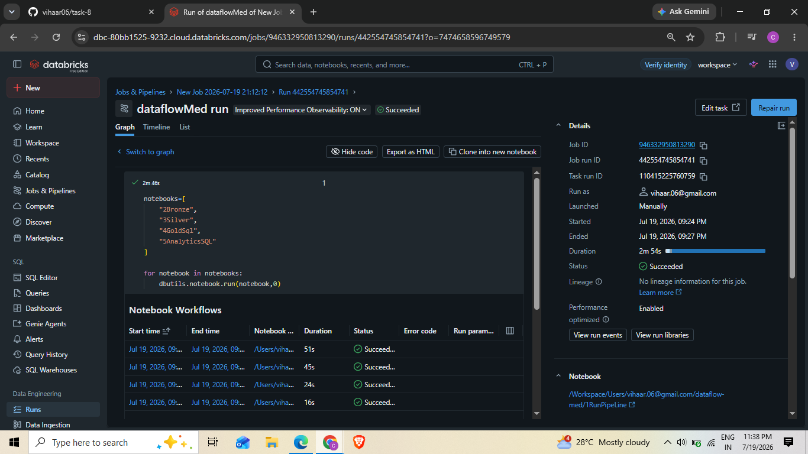

# DataFlow Inc. — Medallion Architecture Data Pipeline

A centralized data platform built on Databricks + Delta Lake that ingests raw CSV/JSON files,
cleans and standardizes them, detects schema drift, tracks historical changes (SCD Type 2),
and produces business-ready tables for analytics — following the **Bronze → Silver → Gold**
(Medallion) architecture.
## Note
-Can you please rename the files to above prefered format.

## Problem Statement

DataFlow Inc.'s data is scattered across raw CSV and JSON files (transactions, logs,
product/customer data) with no central place to analyze it. The team has no way to detect
schema changes, data drift, or ensure data quality, and no historical record of how data
changes over time. This project builds a pipeline that ingests raw data, cleans it, detects
changes, and maintains history for reliable analytics.

## Architecture

```
Raw (CSV/JSON) → Bronze → Silver → Gold → Analytics
```

| Layer | Notebook | Responsibility |
|---|---|---|
| **Bronze** | `2Bronze.ipynb` | Ingests every CSV/JSON file in the raw volume, adds an `ingestionTime` column, writes each as a Delta table — one Bronze table per raw file, no transformation. |
| **Silver** | `3Silver.ipynb` | Cleans each Bronze table (standardizes columns, removes duplicates, drops rows missing required keys), validates/compares schema between runs, and applies **SCD Type 2** to the customers table (tracks history: `effectiveDate`, `expiryDate`, `isCurrent`). |
| **Gold** | `4GoldSql.ipynb` | Reshapes Silver data into business-ready dimension and fact tables (`dimCustomers`, `dimProducts`, `dimSellers`, `factOrderItems`, `factPayments`), joined and aggregated — written entirely in SQL against Silver-registered temp views. |
| **Analytics** | `5AnalyticsSQL.ipynb` | Queries the Gold tables to answer real business questions: revenue trends, top products, seller rankings, customer segmentation, payment value tiers — using `GROUP BY`, `JOIN`, `CASE`, `CTE`s, and window functions. |
| **Orchestration** | `1RunPipeLine.ipynb` | Runs all four notebooks in sequence via `dbutils.notebook.run(...)`. |

### Why Silver → Gold, not just Silver → Analytics

Silver is one clean table per raw source file — still shaped like the source system.
Gold reshapes that into the entities the business actually thinks in terms of (customers,
products, orders), pre-joined and pre-aggregated, so Analytics doesn't have to re-derive the
same joins every time a new question comes up.

### Schema drift & data quality handling

- `compareSchema()` diffs an incoming batch's columns against the existing table and reports
  additions/removals.
- `scdType2Merge()` (used for the customers table) automatically folds any newly-arrived column
  into the set of tracked columns, so a schema change is treated as a real data change instead
  of being silently dropped.
- `alignSchemas()` reconciles column differences between an existing table and an incoming
  batch before any union, so ingesting a batch with a different shape doesn't break the pipeline.
- `processSilver()` drops rows missing required key columns and removes duplicates on every run.

## Tech Stack

- **Python / PySpark** — ingestion, cleaning, generic helper functions, SCD2 merge logic
- **Spark SQL** — Gold and Analytics layers (`CREATE OR REPLACE TABLE`, `JOIN`, `GROUP BY`,
  `CASE`, `CTE`, window functions)
- **Delta Lake** — versioned, ACID-compliant storage for every layer
- **Databricks** — notebooks, Unity Catalog Volumes for file storage, Jobs for orchestration

## Repository Structure

```
.
├── 1RunPipeLine.ipynb   # Orchestrator — runs the full pipeline in order
├── 2Bronze.ipynb        # Raw → Bronze ingestion
├── 3Silver.ipynb        # Bronze → Silver cleaning + SCD2
├── 4GoldSql.ipynb       # Silver → Gold (SQL)
├── 5AnalyticsSQL.ipynb  # Gold → Analytics queries (SQL)
└── README.md
```

## Prerequisites

- A Databricks workspace with a Unity Catalog volume for raw/bronze/silver/gold storage
- Raw source files uploaded to `<your-volume>/raw/` (CSV and/or JSON)
- A cluster or Serverless SQL warehouse with Delta Lake support (default in current Databricks
  runtimes)

Update the `basePath` variable at the top of each notebook to point at your own volume path,
e.g.:

```python
basePath = "/Volumes/<catalog>/<schema>/<your-volume>"
```

## How to Run

### Option A — Run the whole pipeline as a Databricks Job (recommended)

This project includes a Databricks Job that runs all four notebooks end-to-end in order
(Bronze → Silver → Gold → Analytics) with a single click.

1. In your Databricks workspace, go to **Jobs & Pipelines** → find the job (or recreate it by
   pointing a job task at `1RunPipeLine.ipynb`).
2. Click **Run now**.
3. Each notebook runs as its own task via `dbutils.notebook.run(...)`; the job succeeds only if
   every layer completes without error.

Example of a successful end-to-end run:



### Option B — Run notebooks manually, one at a time

Useful the first time you set this up, or when debugging a specific layer:

1. Open `2Bronze.ipynb` → **Run All**. Confirm Bronze Delta tables are created for every raw
   file.
2. Open `3Silver.ipynb` → **Run All**. Watch for `Schema drift detected...` print statements —
   these are expected output, not errors, whenever a table's structure has changed since the
   last run.
3. Open `4GoldSql.ipynb` → **Run All**. Confirm all five Gold tables (`dimCustomers`,
   `dimProducts`, `dimSellers`, `factOrderItems`, `factPayments`) are created.
4. Open `5AnalyticsSQL.ipynb` → **Run All**. Each query cell should return a results table.

Only after all four run cleanly on their own should you run `1RunPipeLine.ipynb` or the
Databricks Job.

## Notes on Re-running

- Bronze and non-SCD Silver/Gold tables use `mode("overwrite")` — safe to re-run any time, the
  table is simply rebuilt from the current source data.
- The Silver customers table is the one SCD2 table: re-running the merge without a new incoming
  batch will correctly detect "no changes" and leave history untouched.
- To reset the SCD2 history and start clean, delete the Silver customers folder before
  re-running:
  ```python
  dbutils.fs.rm(f"{silverPath}/olist_customers_dataset", True)
  ```

## Possible Next Steps

- Add a `dashboardMetrics` Gold table (one row per KPI) so a BI tool can point at a single
  source instead of re-running Analytics queries each time.
- Extend SCD2 tracking to additional tables beyond customers.
- Add row-count / null-rate checks as an automated data-quality gate between Bronze and Silver.

